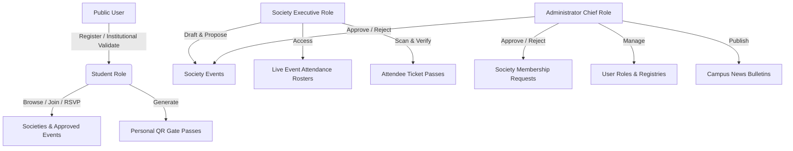
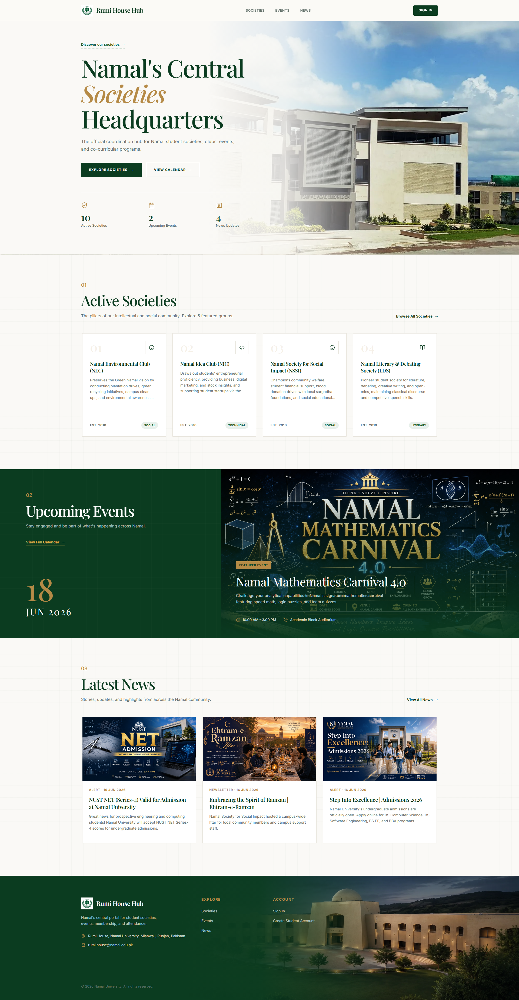
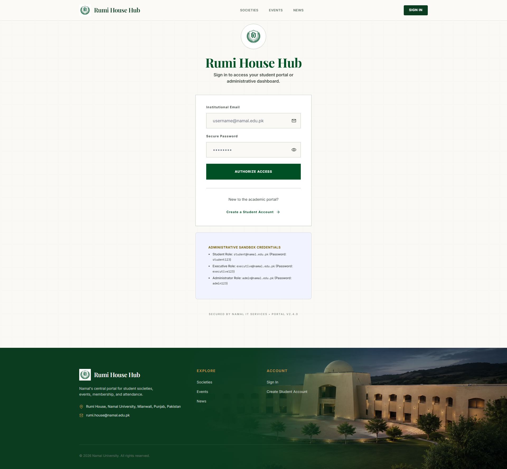
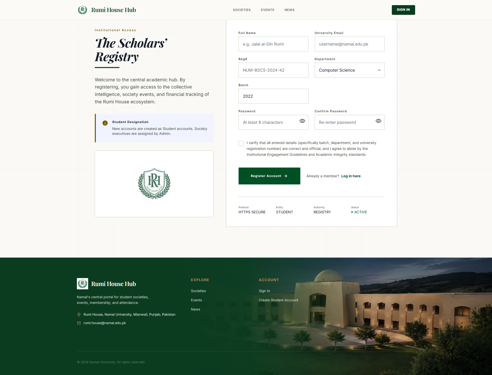
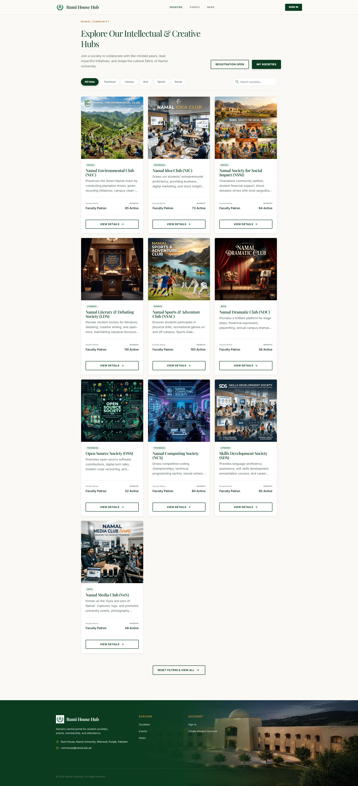
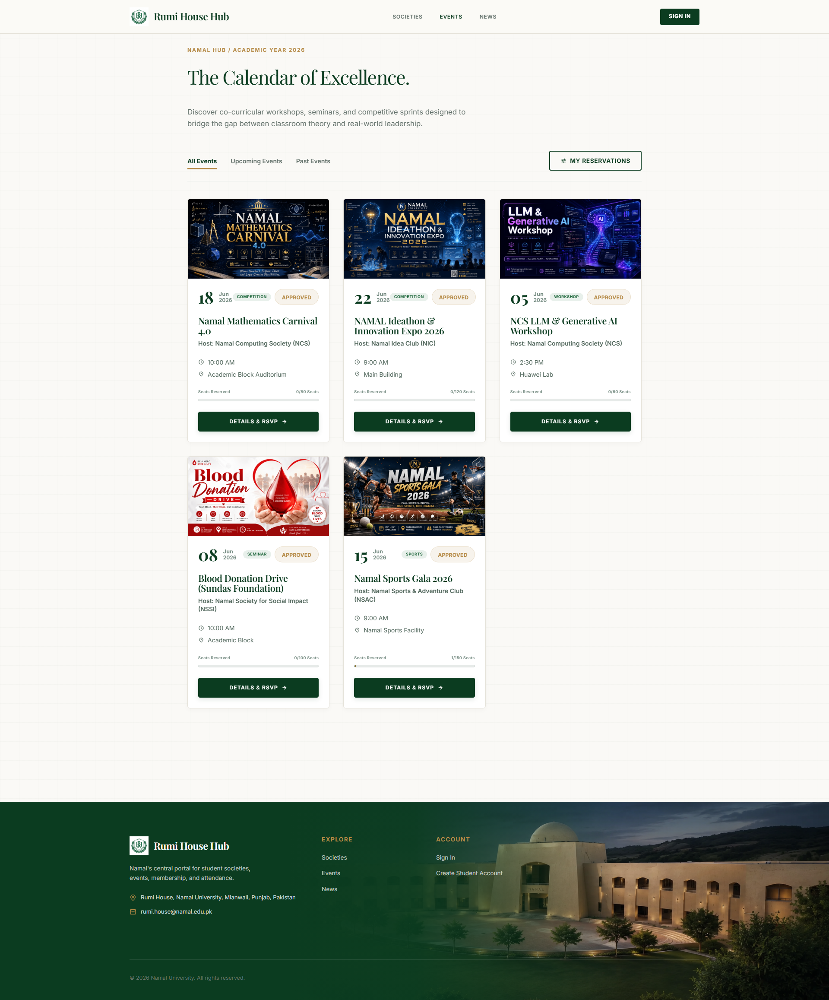
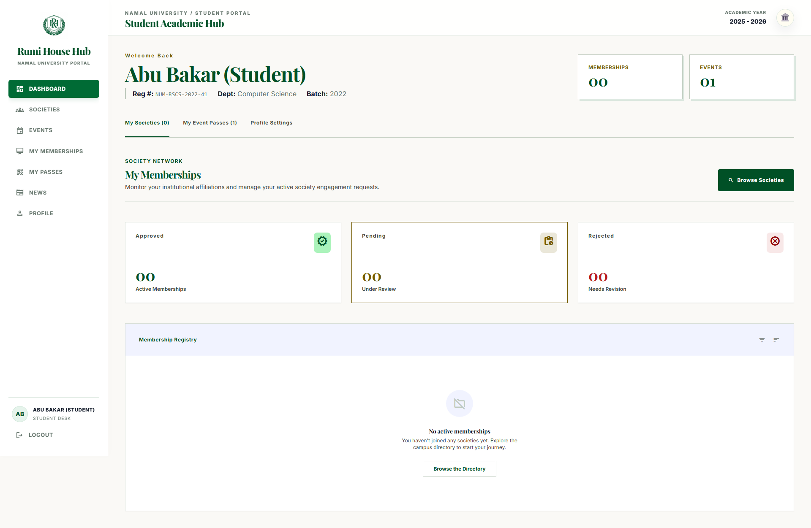
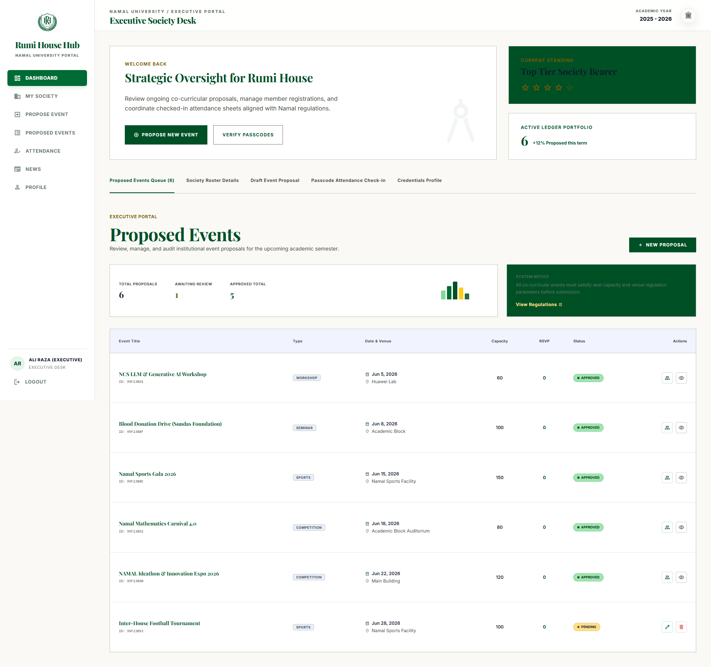
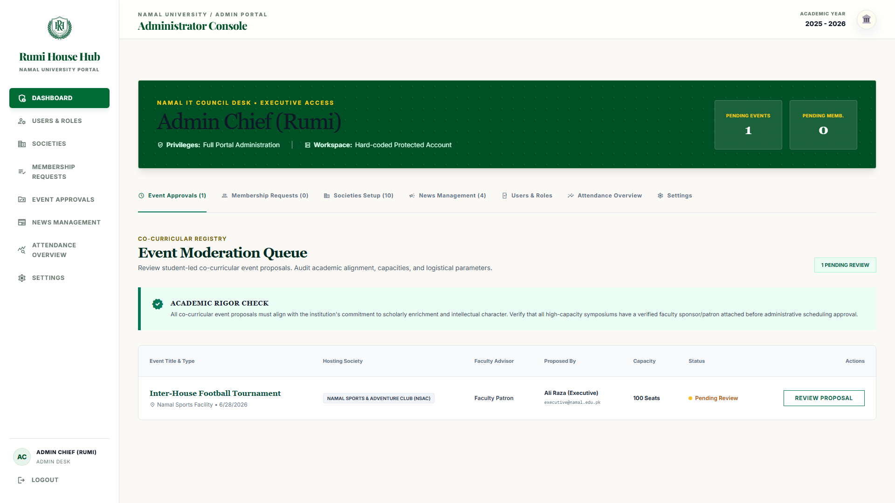

# Rumi House Hub

> **Namal University Student Engagement & Co-Curricular Operations Portal**  
> A full-stack MERN platform designed to unify student engagement, society enrollments, event proposals, dynamic seat reservations, digital QR attendance gate checks, and campus news bulletins.

---

## 🎓 Academic Metadata

* **Course:** Web Application Development (WAD) Course Project
* **Institution:** Namal University, Mianwali  
* **Presenter / Developer:** Abu Bakar  
* **Registration Number:** `NUM-BSCS-2022-41`  
* **Department:** Computer Science (Batch 2022)  

---

## 🛠️ Technology Stack

| Layer | Technology & Frameworks | Key Use Cases |
| :--- | :--- | :--- |
| **Frontend** | React 18, Vite, React Router 6 | Component-based interactive SPA with client-side routing & auth state |
| **Animation & Styling** | GSAP, Tailwind CSS, Bootstrap 5 (scoped) | Fluid micro-interactions, responsive design, and structured grids |
| **Backend** | Node.js, Express.js | Secure REST APIs, token generation, and business validation layers |
| **Database** | MongoDB, Mongoose | Relational document design, unique compound indices, atomic seat allocations |
| **Auth & Security** | JWT (24-hour expiry), Bcrypt, Helmet | Secure session tokens, password hashing, and HTTP response headers protection |
| **Testing** | Vitest (Frontend), Node Native Runner (Backend) | Robust validation (30 frontend tests, 38 backend tests) |

---

## 🚪 User Roles & Access Boundaries

The system segregates functions into three key user roles:



* **Student:** Browse societies and approved events, request club membership, RSVP to events, and view active QR entry passes.
* **Executive:** Propose co-curricular events, inspect live attendance check-in sheets, and scan/verify attendee tickets at the gate.
* **Admin (Rumi Admin):** Moderation rights to approve/reject proposed events and membership requests, manage user roles, and publish campus news.

---

## 📸 Interactive System Showcase

Here is a visual walk-through of the Rumi House Hub interface:

### 1. Home Page
A welcoming landing page presenting Namal's recent news bulletins, ongoing events, and highlighted societies.


### 2. Authentication Portal
Secure logins and registration restricted strictly to institutional `@namal.edu.pk` emails.
* **Sign In Form:**
  
* **Create Account Form:**
  

### 3. Societies Directory
Browse student clubs and submit membership application requests.


### 4. Events Calendar
Browse upcoming events, view specific details, and instantly RSVP to claim a seat ticket.


### 5. Role-Specific Dashboards
Custom interactive dashboards adapted to the user's role:
* **Student Dashboard:** View current society memberships, RSVPs, and scan your unique digital QR entry passes.
  
* **Executive Dashboard:** Draft and submit new event proposals, check live event registrations, and scan tickets.
  
* **Administrator Panel:** Moderate pending events and membership requests, modify user roles, and publish news alerts.
  

---

## 📁 Workspace Structure

```text
Rumi-House-Hub/
├── frontend/                 # React SPA (Vite + React Router 6)
│   ├── src/
│   │   ├── components/       # Reusable layout shells, guards, and navigation
│   │   ├── pages/            # View components (Home, Login, Registers, Dashboards)
│   │   ├── context/          # State providers (Authentication)
│   │   ├── styles/           # Main CSS stylesheets and design tokens
│   │   └── utils/            # Axios API wrappers
├── backend/                  # Node.js/Express REST server
│   ├── config/               # Database setup and connection
│   ├── controllers/          # Route handlers containing business logic
│   ├── models/               # MongoDB Mongoose schemas
│   ├── routes/               # REST API endpoint routes
│   └── utils/                # Token verifiers and role access guards
└── docs/                     # Architectural specifications & guides
    └── screenshots/          # High-resolution screenshots of the portal
```

---

## 💾 Database Schema Reference

The database consists of **7 collections** with relationships described below:

* **`User`**: Names, institutional email, registration number, role (`student`, `executive`, `admin`), department, batch, and hashed passwords.
* **`Society`**: Name, slug, description, patron name, faculty coordinator, member counts, and executive body list.
* **`Membership`**: Tracks club membership requests (`pending`, `approved`, `rejected`) and joined date.
* **`Event`**: Title, location, capacity, registration count, and status (`draft`, `pendingApproval`, `approved`, `rejected`, `past`).
* **`RSVP`**: Tracks student seat reservations; includes a compound index (`eventId` + `userId`) preventing double reservations.
* **`Attendance`**: Verified check-ins recorded at the gate mapping `eventId`, `userId`, and `checkInMethod` (`qr`, `code`, or `manual`).
* **`News`**: Bulletins and announcements published by Administrators.

---

## 🚀 Local Setup & Configuration

### 1. Configure Environments
Copy the example environment files in both folders:
```bash
# In backend/ directory
cp .env.example .env

# In frontend/ directory
cp .env.example .env
```
Ensure `MONGODB_URI` and `JWT_SECRET` are correctly configured inside `backend/.env`.

### 2. Install Dependencies
Run package installs inside both directories:
```bash
# Install backend packages
cd backend
npm install

# Install frontend packages
cd ../frontend
npm install
```

### 3. Seed the Database
> [!WARNING]
> Running the seed command wipes all existing database collections and populates default datasets.

Run the seed command in the backend folder to populate demo societies, news, and default role-accounts:
```bash
cd backend
npm run seed
```

### 4. Start Development Servers
Start both services in separate terminal windows:
```bash
# Run backend (Starts on http://localhost:5000)
cd backend
npm run dev

# Run frontend (Starts on http://localhost:5173)
cd ../frontend
npm run dev
```

---

## 🧪 Testing & Validation

Validate correctness by running the tests, linters, and build tasks:

### Backend Test Suite
Runs Node's native runner to check routes and database schema logic:
```bash
cd backend
npm test
```

### Frontend Tests, Lint, & Build
Runs Vitest unit assertions, ESLint warnings, and builds the production package:
```bash
cd frontend
npm test
npm run lint
npm run build
```

---

## 🔒 System Assumptions & Business Rules
* **Email Lock:** Registration is restricted to `@namal.edu.pk` email addresses.
* **Self-Registration:** New sign-ups default to the `student` role. Role promotions to `executive` or `admin` must be updated by an existing administrator.
* **Capacity Limits:** Events cannot exceed their seat capacity. Once a limit is reached, RSVP buttons are locked.
* **Ticket Lifetime:** Attendance check-in tickets are active from 24 hours prior to the event start time until 24 hours post-conclusion.
