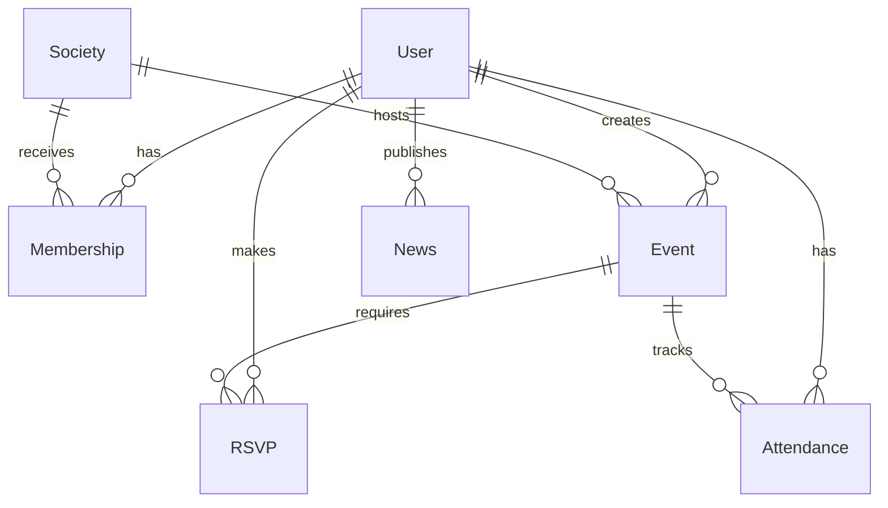

# Rumi House Hub Data Models

This document describes the schemas and relationships for all MongoDB collections in the **Rumi House Hub** ecosystem.

## Models Schema Reference

### 1. User Model (`User`)
Represents students, executive organizers, and system administrators.
* **Fields:**
  * `name` (String, required): Student's full name.
  * `email` (String, required, unique): Validated institutional email ending with `@namal.edu.pk`.
  * `registrationNumber` (String, required, unique): Format `NUM-DEPT-YYYY-ID` (e.g. `NUM-BSCS-2022-41`).
  * `role` (String, required, enum): `student`, `executive`, or `admin`. Default is `student`.
  * `department` (String, required): Student's major department.
  * `batch` (String, required): batch year.
  * `passwordHash` (String, required): Salted bcrypt password hash.

### 2. Society Model (`Society`)
Represents campus clubs or societies.
* **Fields:**
  * `name` (String, required, unique): Society full name.
  * `slug` (String, required, unique): URL-friendly slugified name.
  * `description` (String, required): Purpose and charter description.
  * `patronName` (String, required): Faculty advisor patron sponsor.
  * `facultyCoordinator` (String): Student council liaison coordinator.
  * `category` (String, required, enum): `technical`, `cultural`, `sports`, `social`, `literary`, or `arts`.
  * `memberCount` (Number, default: 0): Active member count.
  * `executiveBody` (Array of subdocuments):
    * `userId` (ObjectId, ref: `User`): Executive user reference.
    * `position` (String): Title (e.g. `President`, `General Secretary`).

### 3. Membership Model (`Membership`)
Handles enrollment records and pending approval requests for societies.
* **Fields:**
  * `userId` (ObjectId, ref: `User`, required): Reference to the student user.
  * `societyId` (ObjectId, ref: `Society`, required): Reference to the society.
  * `status` (String, required, enum): `pending`, `approved`, or `rejected`. Default is `pending`.
  * `joinedAt` (Date): Approved join timestamp.

### 4. Event Model (`Event`)
Represents co-curricular workshops, seminars, competitions, or sporting events.
* **Fields:**
  * `societyId` (ObjectId, ref: `Society`, required): Hosting society.
  * `title` (String, required): Event title.
  * `description` (String, required): Brief overview.
  * `type` (String, required, enum): `seminar`, `workshop`, `competition`, `sports`.
  * `location` (String, required): Venue location.
  * `startDateTime` (Date, required): Event start time.
  * `endDateTime` (Date, required): Event end time.
  * `capacity` (Number, required): Seat count limit.
  * `registered` (Number, default: 0): Seats currently reserved.
  * `status` (String, required, enum): `draft`, `pendingApproval`, `approved`, `rejected`, `past`. Default: `pendingApproval`.
  * `qrCodeToken` (String, required, unique, select: false): Global secret event check-in token.
  * `rejectionReason` (String): Admin comment if event is rejected.
  * `createdBy` (ObjectId, ref: `User`, required): Creator executive/admin.

### 5. RSVP Model (`RSVP`)
Tracks student seat reservations and individual gate check-in pass keys.
* **Fields:**
  * `eventId` (ObjectId, ref: `Event`, required): Reference to the event.
  * `userId` (ObjectId, ref: `User`, required): Reference to the student user.
  * `status` (String, required, enum): `going`, `checked-in`. Default: `going`.
  * `passToken` (String, required, unique, select: false): Unique digital pass token generated with `pass_` prefix.
* **Indices:**
  * Compound index `eventId: 1, userId: 1` enforces unique RSVPs.

### 6. Attendance Model (`Attendance`)
Stores entry verification logs recorded at venue gates by organizers.
* **Fields:**
  * `eventId` (ObjectId, ref: `Event`, required): Verified event.
  * `userId` (ObjectId, ref: `User`, required): Checked-in student.
  * `checkInTime` (Date, default: Date.now): Exact entry verification time.
  * `checkInMethod` (String, required, enum): `qr`, `manual`.
* **Indices:**
  * Compound index `eventId: 1, userId: 1` prevents double check-ins.

### 7. News Model (`News`)
Co-curricular bulletins, newsletters, and announcements.
* **Fields:**
  * `title` (String, required): News title.
  * `summary` (String, required): One-line summary.
  * `content` (String, required): Full text details.
  * `category` (String, required, enum): `events`, `visit`, `academics`, `newsletter`.
  * `image` (String): Optional URL path for bulletin thumbnail.
  * `publishedAt` (Date, default: Date.now): Publication timestamp.
  * `publishedBy` (ObjectId, ref: `User`, required): Creator admin.

---

## Entity Relationships

